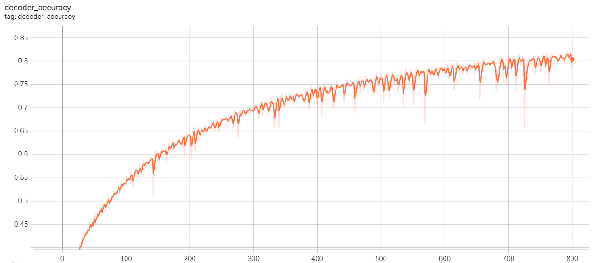

# End to End System to Discover Brain Tumors for Medical Diagnosis
This repository contains the deep learning models for the project. 

The model is based on the paper [3D MRI Brain Tumor Segmentation using Autoencoder Regularization](https://arxiv.org/abs/1810.11654)

Credits goes to the original authors of the paper.

## Setup
Create the environment using `conda`
```
$ conda env create -f environment.yml
```

Activate the environment using
```
$ conda activate model-server
```

Run the flask development server using
```
$ python app.py
```

## Results
Managed to get upto 80% accuracy in 800 epochs. This differs from the accuracy and number of epochs stated in the paper as learning rate scheduling and other optimization techniques were not implemented.
<br/><br/>



## Progress
- [x] Implementing model
- [x] Implementing training regime
- [x] Training Model
- [x] Testing model
- [x] Implemented server